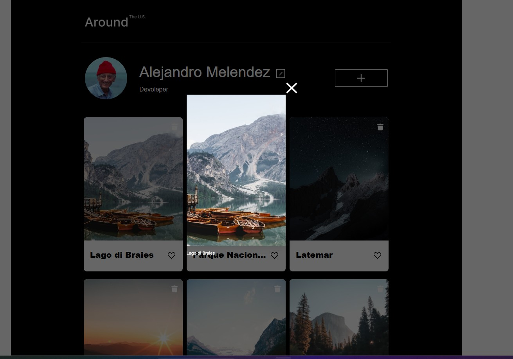

# Proyecto 7: Tripleten web_project_around

# 🗺️ Alrededor de los EE.UU.

Bienvenido a **Alrededor de los EE.UU.**, una aplicación web interactiva desarrollada con HTML, CSS y JavaScript puro. En este proyecto, los usuarios pueden **editar su perfil**, **añadir nuevas tarjetas con imágenes**, **dar "me gusta"** a las fotos y **eliminar tarjetas** de forma dinámica.

---

## 📚 Tabla de Contenido

- [🎯 Objetivo del Proyecto](#-objetivo-del-proyecto)
- [🧰 Tecnologías Utilizadas](#-tecnologías-utilizadas)
- [⚙️ Funcionalidades Clave](#️-funcionalidades-clave)
- [🖼️ Captura de Pantalla](#-captura-de-pantalla)
- [🚀 Cómo Visualizar el Proyecto](#-cómo-visualizar-el-proyecto)
- [🧪 Mejoras Futuras](#-mejoras-futuras)
- [👨‍💻 Autor](#-autor)

## 🎯 Objetivo del Proyecto

Este proyecto fue creado como parte del curso de desarrollo web para aplicar conceptos esenciales como:

- Manipulación dinámica del DOM.
- Creación y control de ventanas emergentes (modales).
- Validación y gestión de formularios.
- Interacción del usuario sin uso de librerías externas.
- Formularios interactivos.
- Buenas prácticas con HTML semántico y CSS modular.
- Interactividad sin frameworks externos.

---

## 🧰 Tecnologías Utilizadas

- ✅ **HTML5** – estructura semántica clara.
- 🎨 **CSS3** – diseño responsivo y modular.
- ⚙️ **JavaScript (Vanilla)** – lógica interactiva.
- 🌐 **Git & GitHub** – control de versiones y despliegue.

---

## ⚙️ Funcionalidades Clave

- ✏️ Edición del perfil con carga previa de datos.
- ➕ Añadir nuevas tarjetas (imagen + título).
- ❤️ Dar "me gusta" a cualquier tarjeta.
- 🗑️ Eliminar tarjetas de forma dinámica.
- 🔍 Visualizar imágenes en tamaño ampliado con popup.
- 🧠 Lógica separada para formularios originales y clonados.

---

## 🖼️ Captura de Pantalla

---

## 🏁 Cómo visualizar el proyecto

Puedes ver el proyecto en acción aquí:  
👉 [https://alejandrom21.github.io/web_project_around/](https://alejandrom21.github.io/web_project_around/)

---

## 🧪 Mejoras Futuras

- Validación avanzada de formularios.
- Almacenamiento de tarjetas en localStorage.
- Subida de imágenes desde el dispositivo.
- Transiciones y animaciones suaves con CSS.
- Mejora de accesibilidad (uso de ARIA y navegación con teclado).

---

## 👨‍💻 Autor

Desarrollado por **Alejandro Meléndez**  
Proyecto académico realizado para **TripleTen - Programa de Desarrollo Web**.
